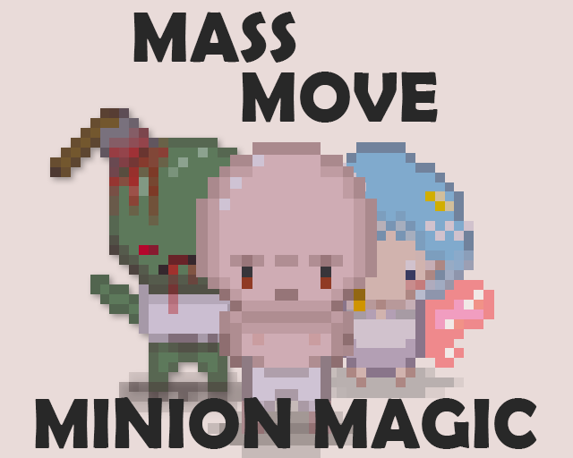
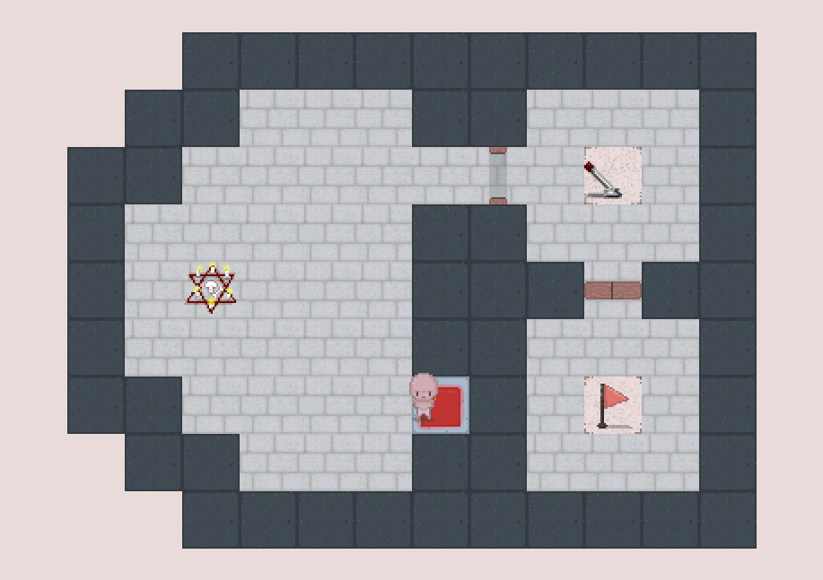

  

> A game about summoning minions and solving puzzles created during the [Ludum Dare 55](https://ldjam.com/events/ludum-dare/55).

In **Mass Move Minion Magic** you summon minions and steer them through puzzles in your different chambers.
The catch? You control all minions at the same time.

  
  
  

## Game Description

Puzzle your way through **17** levels with varying difficulty of pushing buttons, switching switches and alot of running face first into walls.

There are three types of minions which you can summon:

- **The Homonculus** (we call him Garry) is an all-rounder and the only minion type that can finish a level.
- **The Zombie** is a real dumbass, very slow on top as well.
- **The Fae** is an elegant creature who can glide above most dangers.

In the levels you will meet puzzles constructed from different components that are introduced through the game.
There are preassure plates, doors, levers and spike traps to name but a few.

## Installation

The most current version of the game can be downloaded from the [GitHub Release Page](https://github.com/jbettaque/ldjam55/releases).
On there, download one of the *Assets* according to your operating system.

We currently support the following systems:
- **Linux** systems using the *MassMoveMinionMagic.AppImage* all-in-one binary.
  This binary can be run once it is made executable (in your files app under *Properties* or `chmod +x MassMoveMinionMagic.AppImage`)
- **Windows** users should download *MassMoveMinionMagic-win64.zip*, extract it and run the *MassMoveMinionMagic.exe* file contained within.
- If you have the *LÖVE* game engine already installed, *MassMoveMinionMagic.love* can also be downloaded. You'll know what to do with it.

> [!NOTE]
> If you really cannot download anything onto your machine, there is also a web version available at [https://jbettaque.github.io/ldjam55/](https://jbettaque.github.io/ldjam55/).
> Beware though that it tends to lag and not always behave correctly regarding the size of the rendering canvas.
> The game was just not made for the web.

## Code Explainer

*Mass Move Minion Magic* is made using [LÖVE](https://love2d.org/) (and of course also with love ❤️).
Our code is structured as followed

- [main.lua](./main.lua) is the central entry point where our *LÖVE* callbacks (e.g. `keypressed()` or `update()`) are placed.
  These callbacks are then further distributed to our different game modules located in the [game/](./game/) directory.
- [game/minions.lua](./game/minions.lua) is the file where all events are handled that deal with moving minions, minions stepping on and off things and minions interacting with other things.
  Which things exactly are delegated to the tilemap.
- [game/tilemap.lua](./game/tilemap.lua) takes care of rendering the level onto the screen and knows which type of block is at which position.
  It gives out information about these tiles (e.g. whether a tile is walkable or kills minions).
  It also handles all the logic of figuring out which levers open which doors under which circumstances.
  Most of the logic that is purely tile dependent is further dispatched to [game/tiles/](./game/tiles/).
- [game/summoning.lua](./game/summoning.lua) knows which minions can be summoned per level, draws the summoning menu and dispatches to `game/minions.lua` for the actual summoning.
- [game/gui/](./game/gui/) renders all graphical user elements except the summoning menu (because it was created afterwards – this is a game jam project after all).
- [game/state.lua](./game/state.lua) defines the central game state.
  We were honestly not that thorough in using this structure but in theory all other modules require this one to store their state.
- [game/conf.lua](./game/conf.lua) stores "compile-time" configuration of our game.
  This structure was added to ease balancing and tweaking the game during development without having to go through many different places in the code.
